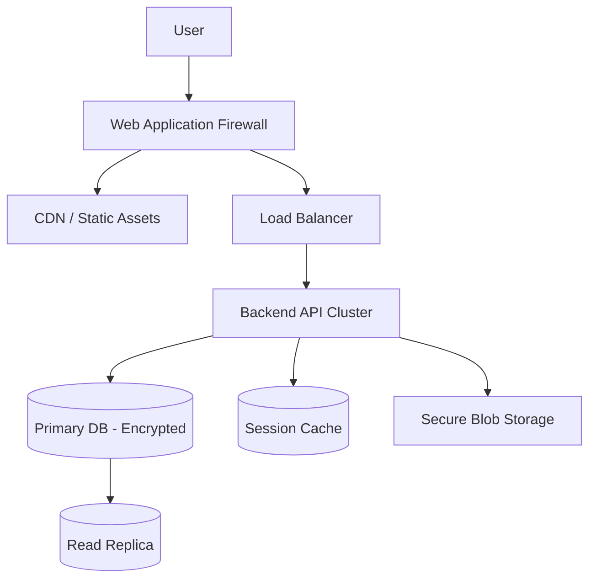

# Production Readiness & Migration Path

## Overview
CAREGRAPH is currently a high-fidelity front-end demonstration. To deploy this application to production, specifically for handling Protected Health Information (PHI), a significant backend engineering effort is required.

## Current Demo State vs Production Requirements
- **State**: In-memory React context.
- **Requirement**: Persistent, encrypted RDBMS (PostgreSQL) + Backend API.
- **Auth**: Mock local state.
- **Requirement**: OAuth 2.0 / OIDC integrated Identity Provider.
- **Hosting**: Static site generation.
- **Requirement**: Secure CDN + Backend server cluster (e.g., Kubernetes or AWS ECS).

## Migration Checklist
- [ ] **Authentication**: Replace mock auth with OAuth 2.0/OIDC (Auth0, Okta, etc.).
- [ ] **Backend API**: Deploy a secure backend API server (Node.js, Go, or Python).
- [ ] **Database**: Set up PostgreSQL or a similar RDBMS.
- [ ] **Encryption**: Implement TLS/mTLS for in-transit, and AES-256 for data at rest.
- [ ] **CORS**: Configure strict Cross-Origin Resource Sharing (CORS) policies.
- [ ] **Rate Limiting**: Add rate limiting to all public-facing endpoints.
- [ ] **Monitoring**: Set up monitoring and alerting (Datadog, New Relic).
- [ ] **Audit Logging**: Implement proper append-only audit log persistence.
- [ ] **Backups**: Set up automated backups and disaster recovery protocols.
- [ ] **Security Audit**: Conduct a full penetration test by a qualified third-party team.
- [ ] **Compliance**: Perform a regulatory compliance review (HIPAA/GDPR assessment).

## Performance Optimization
Before production release, the frontend should be optimized:
- **Code Splitting**: Utilize `React.lazy()` to split dashboard views and heavy charting libraries.
- **Memoization**: Extensive use of `useMemo` and `useCallback` for complex data grids and timelines to prevent unnecessary re-renders.
- **Asset Optimization**: Ensure all icons (Lucide) and images are optimally compressed.

## Deployment Architecture

## Monitoring and Observability
- Distributed tracing must be implemented to track requests from the frontend, through the API, to the database.
- Centralized logging is required to capture application errors without exposing PII in the stack traces.
