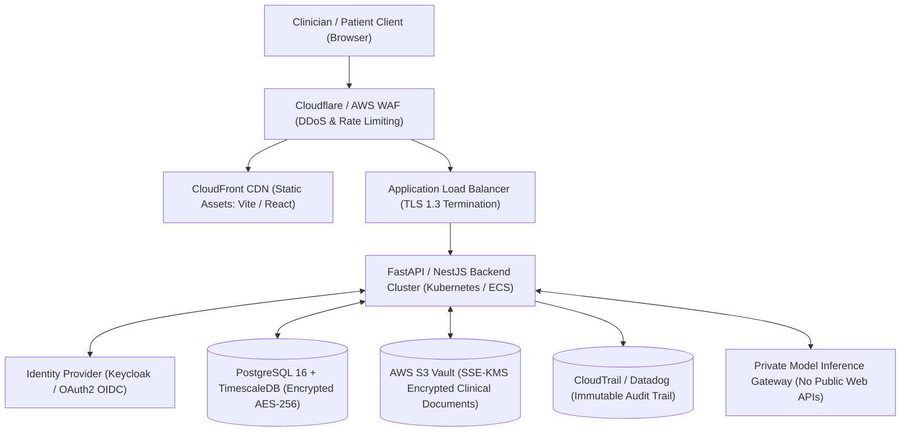

# CAREGRAPH — Production Readiness & Migration Roadmap

> **Notice**: This roadmap outlines the transition from the Phase 9 architecture foundation to a live clinical environment.
> - `[IMPLEMENTED]`: Completed in Phases 8 & 9
> - `[ARCHITECTURAL FOUNDATION]`: Abstract interfaces, error classes, mapping functions, and test harness in place
> - `[REQUIRES PRODUCTION BACKEND]`: Cloud infrastructure provisioning and legal compliance certifications

---

## 1. Phase 9 Completed Architecture Milestones

| Milestone | Status | Description |
|---|:---:|---|
| **Backend Provider Abstraction** | `[IMPLEMENTED]` | `IBackendProvider` and `ApiClient` decouple presentation from data layers. |
| **Database Domain Schema** | `[ARCHITECTURAL FOUNDATION]` | Normalized entity models (`DbPatient`, `DbCondition`, `DbObservation`, etc.) in `apiTypes.ts`. |
| **FHIR R4 Mapping Layer** | `[IMPLEMENTED]` | Bidirectional conversion functions for Patient, Condition, Observation, MedicationRequest, DiagnosticReport, DocumentReference, AllergyIntolerance. |
| **Pluggable Authentication Interface** | `[IMPLEMENTED]` | `IAuthService` decouples `DemoAuthService` from future OIDC providers. |
| **Runtime Mode Abstraction** | `[IMPLEMENTED]` | `VITE_CAREGRAPH_MODE` cleanly separates synthetic demo from production boundaries. |
| **Automated Test Suite** | `[IMPLEMENTED]` | Vitest test harness with 43 automated unit tests across 7 test suites. |
| **PatientRecordContext Decoupling** | `[IMPLEMENTED]` | React context consumes `ApiClient` with zero direct imports from static demo files. |

---

## 2. Production Deployment Migration Checklist

### 2.1 Backend Services & API Gateway [REQUIRES PRODUCTION BACKEND]
- [ ] Deploy containerized API gateway (FastAPI / NestJS / Go) behind Envoy or Kong.
- [ ] Implement `HttpBackendProvider` in frontend to communicate with API endpoints over TLS 1.3.
- [ ] Configure strict CORS rules (`Access-Control-Allow-Origin: https://app.caregraph.health`).
- [ ] Implement token bucket rate limiting (WAF / Cloudflare) to prevent brute force and denial of service.

### 2.2 Identity & Access Management [REQUIRES PRODUCTION BACKEND]
- [ ] Replace `DemoAuthService` with `OidcAuthService` using Keycloak, Auth0, or AWS Cognito.
- [ ] Enforce Authorization Code Flow with PKCE for single-page application security.
- [ ] Mandate Multi-Factor Authentication (TOTP / FIDO2 WebAuthn) for all clinical and administrative roles.
- [ ] Store session refresh tokens in `HttpOnly`, `Secure`, `SameSite=Strict` cookies.

### 2.3 Database & Storage Infrastructure [REQUIRES PRODUCTION BACKEND]
- [ ] Provision managed PostgreSQL 16 cluster with TimescaleDB extension for time-series lab observations.
- [ ] Enable Transparent Data Encryption (TDE) with customer-managed keys via AWS KMS / HashiCorp Vault.
- [ ] Provision AWS S3 bucket with Object Lock compliance mode (WORM) and ClamAV quarantine scanning for uploaded documents.
- [ ] Configure automated daily encrypted snapshots with cross-region replication and point-in-time recovery (PITR).

### 2.4 Audit & Compliance [REQUIRES PRODUCTION BACKEND]
- [ ] Stream audit log entries to append-only, tamper-evident SIEM (AWS CloudTrail / Google Cloud Audit Logs).
- [ ] Complete formal third-party SOC 2 Type II, HIPAA Security Rule, and India DPDP Act compliance audits.
- [ ] Conduct independent penetration testing and dynamic application security testing (DAST).

---

## 3. Production Infrastructure Topology

